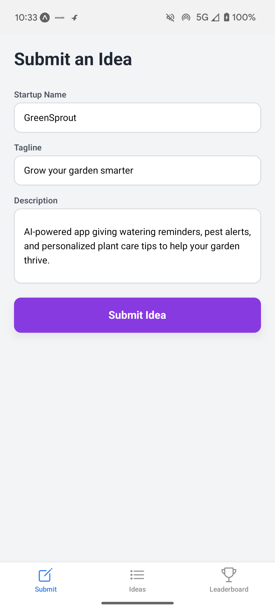
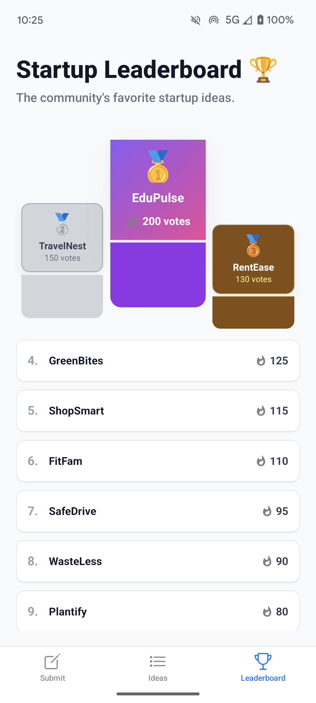

# Startup Ideas React Native Expo App

This is a React Native app built with **Expo** that allows users to submit startup ideas and receive **live AI-generated feedback** instead of static mock data.

---

## Features

- Submit startup ideas via a clean, user-friendly interface
- Get real-time AI feedback on your ideas through the backend API
- Store and display startup ideas locally with AsyncStorage
- Smooth UX with toast notifications for success and errors
- Leaderboard screen showing top-voted startup ideas with a podium view

---

## Technology Stack

- React Native with Expo
- Redux Toolkit for state management
- AsyncStorage for local persistence
- react-native-toast-message for notifications
- Integration with a live AI feedback backend API

---
## Screenshots

### Idea Submission Screen

### Ideas Listing Screen

### Leaderboard Screen

### AI Feedback Display

## Getting Started

### Prerequisites

- Node.js installed (version X or higher)
- Expo CLI installed globally (`npm install -g expo-cli`)
- Access to the live AI feedback backend URL

### Installation
- npm install
- npx expo start